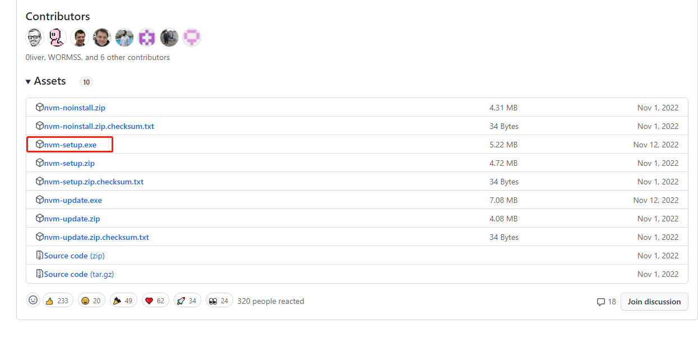

##1、使用nvm管理node的版本 
###1）nvm 下载地址：https://github.com/coreybutler/nvm-windows/releases

###2）nvm相关命令
```
nvm ls 查看可用版本
nvm install 版本号 // 例如：nvm install 12.22.12
nvm list 查看已经安装的版本
nvm list installed 查看已经安装的版本
nvm list available 查看网络可以安装的版本
nvm use 12.22.12 ## 切换使用指定的版本node
nvm current显示当前版本
nvm on 打开nodejs控制
nvm off 关闭nodejs控制
```

## 2、npm 版本管理使用命令：
`npm install npm@6.14.16 -g `


## 3、查看版本的对应关系地址：
https://nodejs.org/zh-cn/download/releases/


## 4、设置npm源
```
npm install -g nrm
nrm ls
nrm use taobao
或者也可以直接设置：
npm config set registry https://registry.npm.taobao.org
```